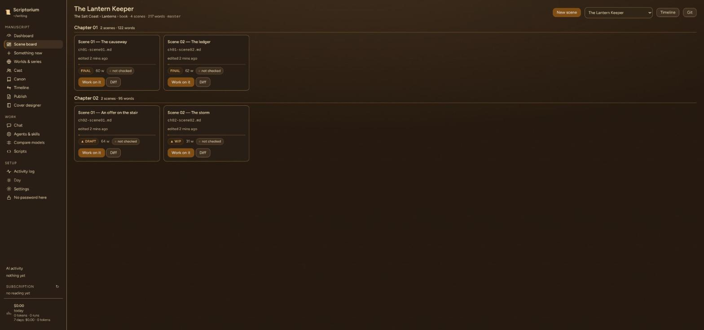
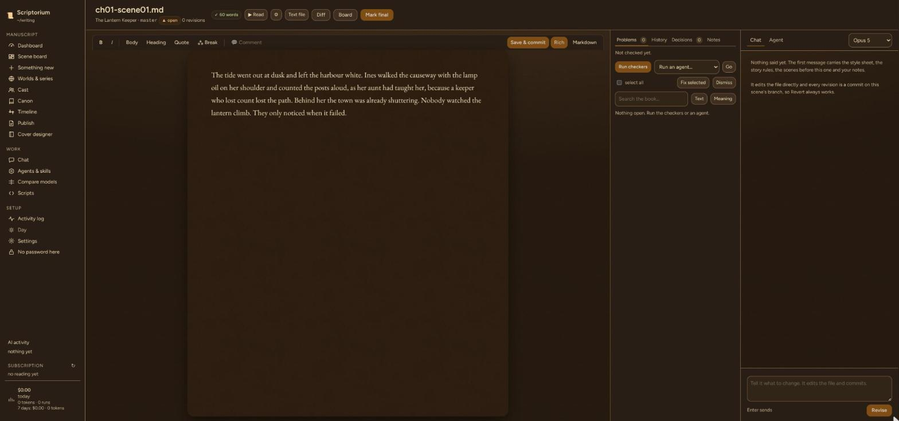
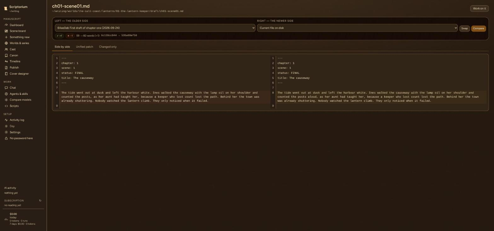
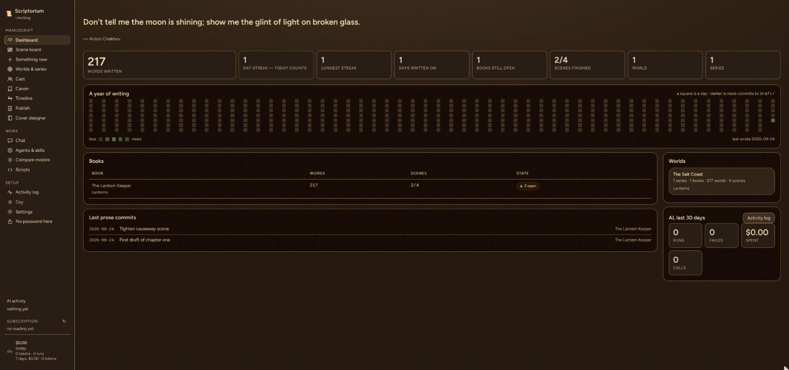

# Scriptorium

**A self-hosted writing desk for novelists.** Scriptorium sits on top of a library of git-backed manuscripts and gives one writer a browser workspace for the whole thing: a scene board per book, a quality gate of per-book checkers, three-way diffs, Claude Code chat bound to the right book, and AI reviewers you build yourself.

It runs on your own machine and you reach it from a laptop, tablet or phone on your home network. Markdown on disk stays the source of truth.



> Screenshots show a demo library with sample prose, not real manuscripts.

## Features

- **One library, many books.** Worlds hold series, and series hold books and novelettes. Characters and history live at world level, so a character can cross between series. Each book is its own git repository.
- **Scene board.** Every scene in a book as a card, grouped by chapter, with word count, draft status and the result of the last quality check.
- **The gate.** Every `tools/*.py` script in a book becomes a checker automatically. Results have three states: *pass*, *review* (it reported findings but gave no verdict) and *fail*. The gate can run on every save.
- **Diffs from three sources.** Compare against git (HEAD, any branch or commit), the on-disk backup, or snapshots taken automatically before and after every save. Views: side by side, unified patch, or changed lines only.
- **Claude Code in the browser.** Chat runs `claude -p` in the directory of the selected world, series or book, so the right `CLAUDE.md`, skills and project settings apply. Sessions resume across turns, tool calls stream live, and you can switch model and permission mode mid-conversation.
- **Build your own agents.** Describe a reviewer, continuity checker, skill, Python checker or HTML page. An *isolated* throwaway session writes it, and you review it before saving. Generated Python never runs until you approve it.
- **Context levels per agent**, from `fresh` (no repo access at all, just the file pasted in) up to `world` (every series readable). Fresh-context reviewers are readers who haven't been told what to think.
- **Model routing.** `config/models.yaml` sends each kind of work to a suitable model, and a cheap router can pick the model for a new agent and explain why.
- **Local and gateway models.** Ollama and OpenAI-compatible gateways are available for read-only agents. Anything that edits a manuscript goes through Claude Code.
- **Model comparison.** `/compare` sends one identical prompt to several models and puts the prose side by side, with Claude isolated from its tools so the comparison is fair.
- **Guided creation.** `/create` builds a new world, series or book by asking a short set of questions and shows the full file plan before writing anything.
- **Search.** Exact-text search across every scene, plus semantic search via local Ollama embeddings, so no unpublished manuscript leaves the machine.
- **Publishing tools.** Exports a print interior and an ebook `.docx`, a cover designer (spine width from page count and paper; front/spine/back cutting), and optional cover artwork from your own ComfyUI.
- **Shelf display API.** `GET /api/device/display` returns about 1 KB of plain-ASCII writing stats (today's words, streaks, book progress, a year of activity) for a small screen such as an ESP32 with a TFT panel.

| Scene editor | Diff |
|---|---|
|  |  |



## Tech stack

Python · FastAPI · Uvicorn · Jinja2 · SQLite · vanilla JS · Pillow · Claude Code CLI · Ollama · OpenAI-compatible gateways · ComfyUI (optional) · git

## How it works

Scriptorium runs as a small web app on the writer's own machine, next to their manuscripts, and is reached over the home network. Models are called through the Claude Code CLI, a local Ollama instance or OpenAI-compatible gateways. The app keeps a single SQLite file for what doesn't belong in a manuscript repo: chat transcripts, scene snapshots, check results and the agents you've built.

The library is a plain folder tree, and every book is its own git repository:

```
~/writing/
  worlds/
    <world>/
      world.yaml
      _bible/                  shared by every series in the world
      <series>/
        series.yaml
        _bible/
        <book>/                a git repository
          book.yaml
          draft/ch01-scene01.md
          tools/check_scene.py
```

Chapter, scene and status are read from the filename (`ch03-scene02-WIP.md`) or from YAML front matter. Any `tools/*.py` script in a book becomes a checker in the gate.

## Design principles

- **Markdown on disk is the truth.** Nothing is duplicated into a database, and edits are written straight back to the files.
- **Honest checks.** A checker that reports findings without a verdict shows as *review*, never as *pass*.
- **No unreviewed code runs.** Generated scripts are shown first and run only after explicit approval.
- **Isolated reviewers.** Agents built in the app don't inherit your chat context, so a reviewer can't quietly rely on things only one conversation knew.
- **Private by default.** Semantic search uses local embeddings, so unpublished manuscripts don't leave the machine.

## Availability

The source code is not public. Scriptorium is available for licensing, custom deployment or white-label adaptation. Get in touch via [munda.si](https://www.munda.si/#contact).

## License

Proprietary. © 2026 MUNDA PLUS d.o.o. All rights reserved. See [LICENSE](LICENSE).

## Author

Built by [Marko Munda](https://www.munda.si/) · [Munda Plus](https://github.com/MundaPlus)
